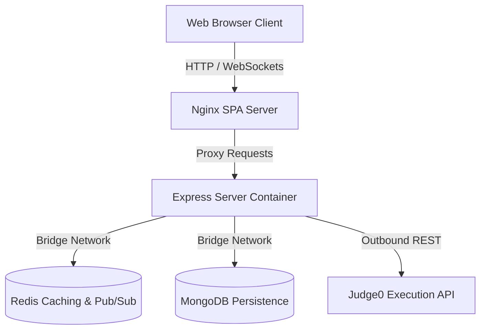

# CodeSync — Real-Time Collaborative Workspace

CodeSync is a production-ready collaborative coding environment allowing developers to program together in real-time, execute multi-language code snippets, and communicate via integrated workspace chat rooms.

---

## 🏗️ Architecture Overview

The platform uses a containerized, decoupled architecture:
*   **Frontend**: Vite + React served by Nginx (`codesync-client` container).
*   **Backend**: Node.js, Express, and Socket.io HTTP/WS server (`codesync-server` container).
*   **Database**: MongoDB for user profiles, persistent room states, and chat message history.
*   **Cache**: Redis for instant room active-user tracking and in-flight editor state caching.
*   **Code Execution**: Integrates with the Judge0 compiler API to safely run code submissions.



---

## ⚙️ Environment Variables Required

Configure these variables in your deployment environment (refer to `.env.example` for details):
*   `PORT`
*   `MONGODB_URI`
*   `REDIS_URL`
*   `JWT_SECRET`
*   `JWT_REFRESH_SECRET`
*   `JUDGE0_API_URL` (Defaults to public endpoint `https://ce.judge0.com` if using free tier)
*   `JUDGE0_API_KEY` (Leave blank if using the public `ce.judge0.com` free tier. If using the RapidAPI hosted Judge0 service, get your key from the [RapidAPI Judge0 CE Portal](https://rapidapi.com/judge0-official/api/judge0-ce/))
*   `CLIENT_URL`
*   `VITE_API_URL`
*   `VITE_SOCKET_URL`
*   `SENTRY_DSN`
*   `VITE_SENTRY_DSN`
*   `ROOM_TTL_DAYS`

---

## 🛠️ Production Considerations

*   **Rate Limiting & Abuse Prevention**: Requests to `/api/execute` are throttled to 5 requests per minute using `express-rate-limit` to prevent resource abuse.
*   **Judge0 Sandboxing**: Code executions are bounded with explicit limits (`cpu_time_limit: 5s`, `wall_time_limit: 10s`, `memory_limit: 128MB`) to block infinite loops and memory hogging.
*   **Horizontal Scaling**: WebSockets scale horizontally across multiple node instances using `@socket.io/redis-adapter` over Redis Pub/Sub.
*   **Graceful Degradation**: If Redis goes down, WebSocket operations and controller caching automatically fall back directly to MongoDB with zero downtime.
*   **Retry Logic**: Debounced MongoDB database writes are guarded by a 3-pass exponential backoff retry mechanism to ensure no code changes are lost during database spikes.
*   **Stale Room Cleanup**: An automated daily cleanup cron task deletes inactive rooms and associated messages if `updatedAt` is older than `ROOM_TTL_DAYS` (default 30).
*   **Conflict Resolution Model**: Uses a Last-Write-Wins (LWW) conflict model (no complex OT/CRDT engine is implemented, representing a pragmatic trade-off for scope).

---

## 🚀 Quick Start (Local Setup)

### Prerequisites
- Docker & Docker Compose installed.

### Steps
1. **Prepare Environment File**:
   ```bash
   cp .env.example .env
   ```
2. **Build and Run Services**:
   ```bash
   docker-compose up --build -d
   ```
3. **Verify Deployment**:
   *   Production Client: `http://localhost:3000`
   *   Express Server: `http://localhost:5000` (Healthcheck endpoint: `/`)
